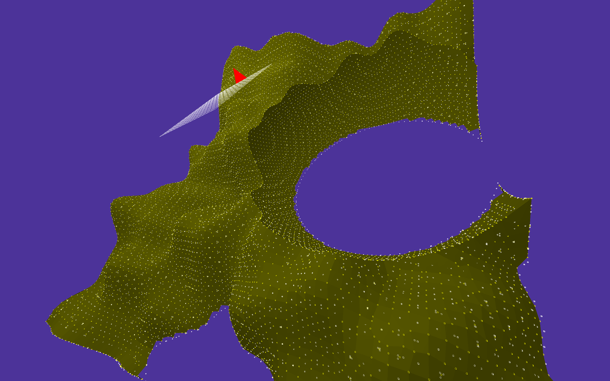

# Voxelized3D-Rust

# Dependencies
* rust(cargo)
* OpenGL >= 3.3.0 (detected automatically)
* cmake
* gfortran (no need for this on Mac)
* xorg-dev package for linux with X11 window system
* OpenBlas (or accelerate framework on Mac, distributed with the OS, no need to install anything)

# Pics

