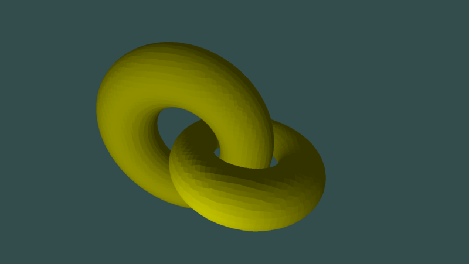

# Voxelized2D-Rust



# Dependencies
* rust
* glfw3
* OpenGL >= 3.3.0

# how to build on Ubuntu 16.04 - 17.10 (including installation of dependencies)
```
$ sudo apt-get update
$ sudo apt-get install curl
$ sudo apt-get install libglfw3-dev
$ sudo apt-get install git
$ curl -s https://static.rust-lang.org/rustup.sh | sh -s -- --channel=nightly

$ cd <Directory where you want to compile Voxelized2D-Rust>
$ git clone https://github.com/Russoul/Voxelized2D-Rust
$ cd Voxelized2D-Rust
$ ~/.cargo/bin/cargo run --release
```
